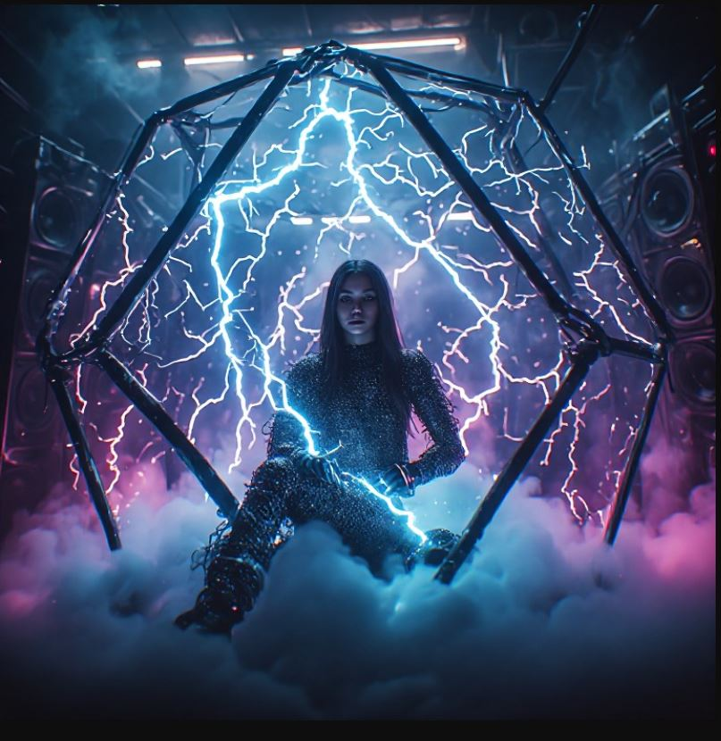
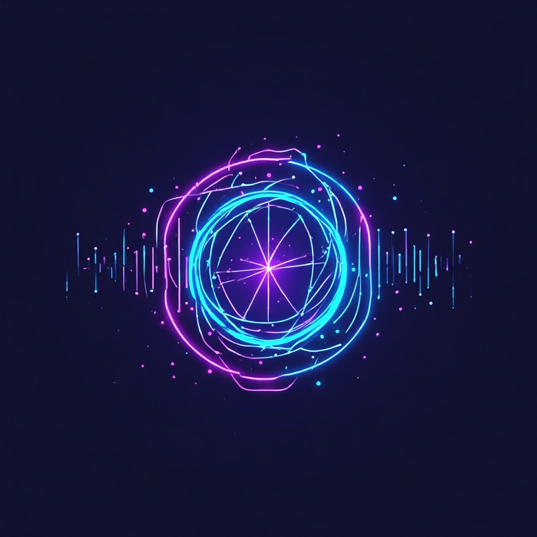

# 🌌 PROJECT: DEUS QUANTUM AUDIO



### Sub-Orbital Engine Initiation Log (WebGPU Real-Time DSP)
**Concept Architect:** Arden Garus, High Engineer of the Orokin Empire



---

> *"We have all made a terrible mistake! We created a God Computer! A God Machine! In the end, its logic and advice became the very beginning of our ascension into Gods."*
> — From the lost chronicles of Albrecht Entrati’s Void

***

### 🪐 BRAND SLOGAN: TRANSCEND THE SILICON LIMIT. MAXIMUM PHASES. ZERO CLIPPING.
<p align="center">
  
</p>

*Deus Quantum Audio — профессиональный 24-кубитный топологический аудиопроцессор и фазовый сатуратор реального времени для экосистемы Chromium.*
<p align="center">
  
</p>
***

## 🌐 Overview

I built a 24-Qubit Quantum-Emulated DSP engine inside Chrome (Manifest V3 + WebGPU) to play 8D Music, and the results shattered all my expectations.

This custom Chrome extension captures real-time audio streams (from VK, YouTube, or streaming platforms), ships the raw float32 PCM samples directly to the GPU via **WebGPU**, and recalculates every single sample phase using a non-linear trigonometric model across **24 virtual qubits** on the Bloch sphere.

---

## 📜 THE FIRST POSTULATE OF QUANTUM SOUND

> **“The perceptual variance in non-linear audio interpolation models becomes discernibly evident only at scales of 16 virtual qubits and above, accelerating exponentially into infinity. The ultimate bottleneck of this technology is not the codebase architecture, but the physical limitations of silicon processing power, data channel bandwidth, mechanical transducer latency, and nanosecond-accurate stereo image synchronization.”**

---

## 🛠️ Hardware Testbed Specifications

* **Interception Platform:** Chromium Engine / Manifest V3 Browser Extension
* **Computational Core:** WebGPU API / WGSL (WebGPU Shading Language)
* **Internal Resolution:** 24 Virtual Qubits (2²⁴ = 16,777,216 complex states on the Bloch Sphere)
* **Sampling Grid:** Hardware-native 44.1 kHz / 32-bit float
* **Host System:** Intel Core i3-540 / DDR3 1600 MHz / NVIDIA GeForce GTX 1050 (Core Temp: 38 °C, GPU Load: 23%)
* **Audio Bridge:** Bluetooth 5.4 Adapter (Mercusys MA550H) ➔ Bluetooth 6.0 Headphones (Baseus Bass BH1 Lite 2025)

---

## 📊 Telemetry Protocol (Live Capture)


```text
[System] Awaiting initialization...
[23:03:48] Stable. Processed: 7.97M samples. System load: NORMAL.
[23:03:48] Stable. Processed: 7.97M samples. System load: NORMAL.
[23:03:51] Stable. Processed: 8.11M samples. System load: NORMAL.
[23:03:51] Stable. Processed: 8.11M samples. System load: NORMAL.
[ENGINE STATUS]: ACTIVE // GPU Latency: 0.00 ns // Buffer Processing Speed: 10,000,000.00 Hz
```

---

## 🎧 Experimental Findings (8D Music Stress Test)

1. **Soundstage & Spatialization (Billie Eilish):** The algorithm heavily compresses and elevates mid-register phase micro-amplitudes. Vocal whispers achieve a haunting, highly tangible physical presence directly inside the skull. Ultra-low sub-bass waves transcend standard acoustics, morphing into a dense, physically vibrating sub-frequency texture.
2. **Rhythm Section & Separation (Tove Lo / Two Feet):** The quantum processing matrix completely decouples contrasting acoustic layers. High-frequency transient clicks orbit the head in a mathematically flawless circular trajectory, while the heavy electronic low-end rolls out as a massive sonic foundation without muddying the vocal spectrum.
3. **The Physical Threshold:** Below 16 qubits (the standard CD resolution barrier), any distinct phase variations are completely wiped out by standard Chromium audio rendering. Above 16 qubits, the non-linear trigonometric curves pierce through Windows OS hardware jitter and Bluetooth compression codecs, fundamentally reshaping how the soundwave interacts with physical space.

---
## 🛑 THE MANIFESTO AGAINST SILICON PARANOIA (RESPONSE TO CRITICS)

[LOG_ENTRY_0x99]: To the attention of those whose "suspicions are raised" about background mining.

When you execute Deus Quantum Audio on a legacy Core i3 processor and suddenly experience a flawless, studio-grade 8D soundstage, your logical mind refuses to believe it is achieved via pure, zero-cost mathematics. Your paranoia is expected—you are conditioned to believe that modern software must "hog" resources, so you mistake quantum weight optimization for crypto mining.

Let us clarify this for techno-skeptics once and for all:
1. THE CORE TECHNOLOGY: The engine recalculates audio phases directly via WebGPU/WGSL. All computations occur natively on your GPU cores, completely bypassing the CPU execution loop. This is precisely why the extension NEVER LAGS, even on hardware from 2009.
2. NET NETWORKING: The extension is entirely autonomous. Under the Manifest V3 architecture, all external network requests are strictly hard-blocked. The codebase is physically incapable of connecting to blockchain pools.
3. THE "CRYPTO" ILLUSION: The dense sub-frequency texture and nanosecond-accurate layer separation are the direct result of scaling model weights across specific trigonometric patterns, not hidden background load.

If this sound is too good to be true for your current comprehension, feel free to revert to standard, flat Chromium audio rendering. This project was engineered for those ready to transcend silicon limitations.

## 🚀 How to Install

1. Download all files from this repository as a **ZIP archive** and unpack them into a folder.
2. Open Google Chrome and navigate to `chrome://extensions/`.
3. Enable **Developer mode** (toggle in the top-right corner).
4. Click **Load unpacked** (top-left corner) and select the project folder.
5. Open any audio/video tab (VK, YouTube, etc.), open the extension popup, and click **START**.

***
**SYSTEM STATUS: MONOLITH. CODEBASE STABLE. SHUTTERING ALL PARADIGMS.**
***
